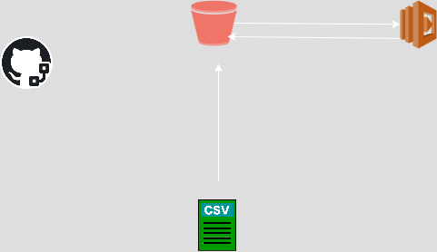
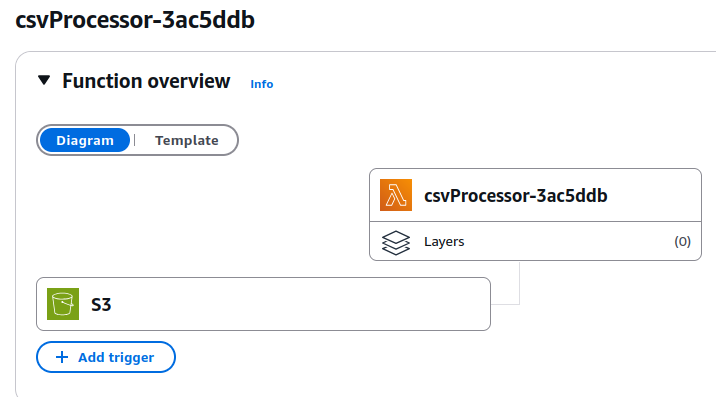
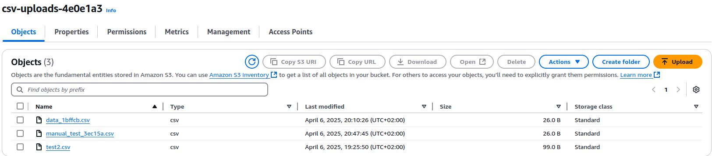
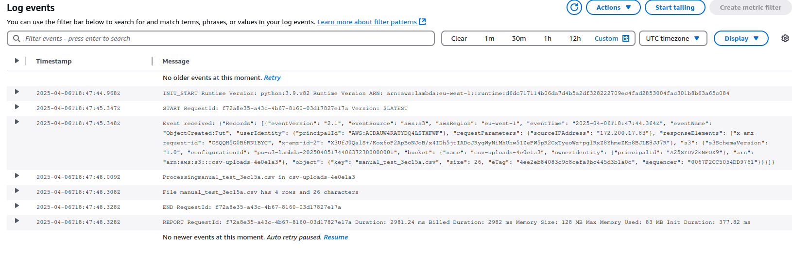

# Processing CVS file with lambda

## Architecture
1. **S3 Bucket**: Store CSV files Almacena with SSE-S3 cypher.
2. **Lambda Function**: It activates when a CSV is uploaded, then process the file.
3. **IAM Roles**: Minimal permissions for Lambda(S3 read and logs).
4. **Event Notification**: S3 configuration to notify Lambda.
5. **Tests**: A folder where store files to test infra.
6. **Github Action CI/CD pipeline**: a pipeline to do every previous step with some tests.



## Deployment
1. **Minimal requirements**:
   - Pulumi CLI.
   - AWS CLI.
   - Python 3.9+.
   - An AWS credentials.
   - Pulumi token.

2. **Manual Steps**:
   ```bash
   curl -sSL https://get.pulumi.com | sh
   alias pulumi=~/.pulumi/bin/pulumi
   python3 -m venv env
   source env/bin/activate
   env/bin/pip3 install -r requirements.txt
   pulumi stack init dev
   pulumi config set aws:region eu-west-1
   pulumi up```

3. **Automated step**
   Through Github Action CI/CD pipeline.

## Pulumi and Lambda Explanation ##

I have decided to create a Lambda function that processes a CSV file and count how many rows and words has that csv. It uses Pulumi and I chose to use a '**dev**' environment in the '**eu-west-1**' region.
The **__main_:.py** file has the Pulumi IaC logic:

- Creates a S3 bucket with AES256 encryption. It has the name **csv-uploads** plus a randon string due to S3 unique name restrictions.
- There is a IAM role for Lambda. 
- A policy acess to S3 bucket to let Lambda get objects.
- The proper Lambda function named **csvProcessor**:
    - It uses Python 3.9.
    - The handler.handler is the starting point
    - The code is packed in a directory named **lambda**.
    - It has a **timeout** of 60 seconds.
    - Log level to info.
- Pemissions to S3 for invoking Lambda.
- Exporting resources output fro being used later.

The Lambda function



An example of the bucket created by Pulumi:



Two other files are related to Pulumi: **Pulumi.yaml** that contains the metadata of the project like runtime (Python) or the name of the project. The other one is **Pulumi.dev.yaml** that contains variables for the dev stack. If in the future it needs a new enviroment or stack with a different AWS region, simply we need to create a new file like 'Pulumi.pro.yaml' with other values.

## Github Actions CI/CD pipeline **

A CI/CD pipeline under **.github/workflows/main.yaml** has two steps:

- test: it tests if code is ok through pytest.
- deploy: It has all the important logic: install all Python and Pulumi dependencies, execute Pulumi stack without human action and finally make a test creating a small and random csv file that is uploaded to th bucket and triggers the Lambda function. If the Lambda function is invoked we could see in Cloudwatch logs that activity.




